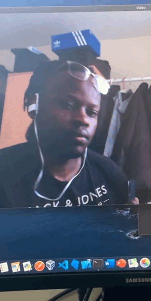

# Facial-Recongition
Python3 based Facial Recongition which allows you to printscreen the livefeed

# Requirement
<li>pip install PyAutoGUI</li>
<li>pip install numpy</li>
<li>pip install opencv-python</li>
<li>pip install face_recognition</li>

Alternatively pip install -r requirements.txt

